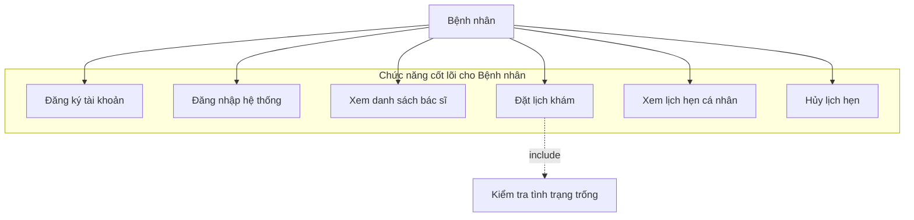
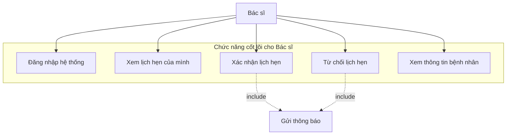
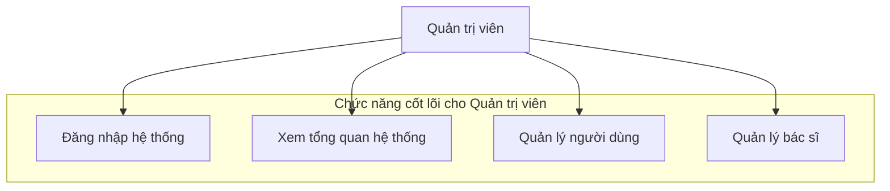
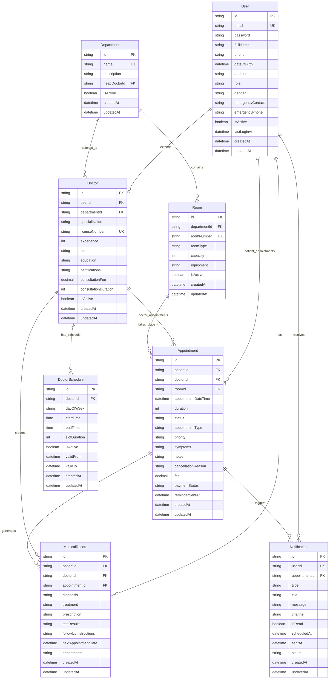
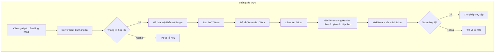
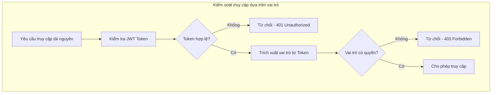
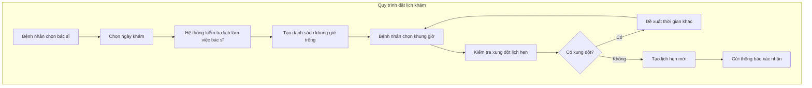
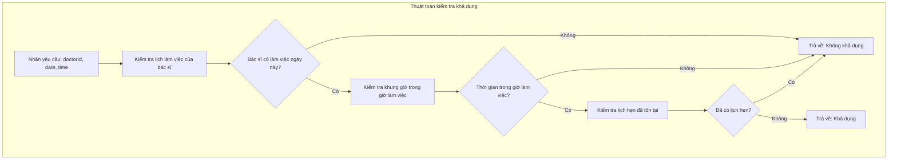
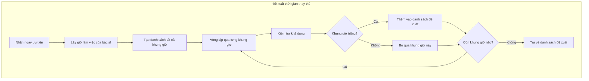

# CHƯƠNG III: PHÂN TÍCH, THIẾT KẾ VÀ TRIỂN KHAI ỨNG DỤNG

## 3.1 Phân tích và Thiết kế Hệ thống

### 3.1.1 Mô hình hóa chức năng

#### 3.1.1.1 Biểu đồ Use Case cho Bệnh nhân



#### 3.1.1.2 Biểu đồ Use Case cho Bác sĩ



#### 3.1.1.3 Biểu đồ Use Case cho Quản trị viên



#### 3.1.1.4 Mô tả chi tiết Use Case quan trọng

**Use Case UC1: Đăng ký tài khoản**

| Thông tin | Chi tiết |
|-----------|----------|
| **Tên Use Case** | Đăng ký tài khoản bệnh nhân |
| **Tác nhân chính** | Bệnh nhân |
| **Mục tiêu** | Tạo tài khoản mới để sử dụng hệ thống |
| **Điều kiện tiên quyết** | Không có |
| **Điều kiện thành công** | Tài khoản được tạo thành công và có thể đăng nhập |

**Luồng chính:**
1. Bệnh nhân truy cập trang đăng ký
2. Hệ thống hiển thị form đăng ký
3. Bệnh nhân nhập thông tin cá nhân (họ tên, email, số điện thoại, mật khẩu)
4. Bệnh nhân xác nhận mật khẩu
5. Bệnh nhân nhấn nút "Đăng ký"
6. Hệ thống kiểm tra tính hợp lệ của dữ liệu
7. Hệ thống kiểm tra email đã tồn tại chưa
8. Hệ thống mã hóa mật khẩu và lưu thông tin
9. Hệ thống hiển thị thông báo đăng ký thành công
10. Chuyển hướng đến trang đăng nhập

**Luồng thay thế:**
- 6a. Dữ liệu không hợp lệ: Hiển thị thông báo lỗi và yêu cầu nhập lại
- 7a. Email đã tồn tại: Thông báo lỗi và đề xuất đăng nhập
- 8a. Lỗi hệ thống: Hiển thị thông báo lỗi và yêu cầu thử lại

**Use Case UC5: Đặt lịch khám**

| Thông tin | Chi tiết |
|-----------|----------|
| **Tên Use Case** | Đặt lịch khám bệnh |
| **Tác nhân chính** | Bệnh nhân |
| **Mục tiêu** | Cho phép bệnh nhân đặt lịch khám với bác sĩ |
| **Điều kiện tiên quyết** | Bệnh nhân đã đăng nhập vào hệ thống |
| **Điều kiện thành công** | Lịch hẹn được tạo thành công và chờ xác nhận |

**Luồng chính:**
1. Bệnh nhân chọn chuyên khoa cần khám
2. Hệ thống hiển thị danh sách bác sĩ thuộc chuyên khoa đó
3. Bệnh nhân chọn bác sĩ và xem thông tin chi tiết
4. Bệnh nhân chọn ngày khám
5. Hệ thống hiển thị các khung giờ trống trong ngày
6. Bệnh nhân chọn khung giờ phù hợp
7. Bệnh nhân nhập triệu chứng và ghi chú (tùy chọn)
8. Bệnh nhân xác nhận thông tin đặt lịch
9. Hệ thống tạo lịch hẹn với trạng thái "Chờ xác nhận"
10. Hệ thống hiển thị thông báo đặt lịch thành công

**Luồng thay thế:**
- 5a. Không có khung giờ trống: Hệ thống đề xuất ngày khác
- 8a. Thông tin không hợp lệ: Hệ thống yêu cầu nhập lại
- 9a. Lỗi hệ thống: Hiển thị thông báo lỗi và yêu cầu thử lại

### 3.1.2 Thiết kế Cơ sở dữ liệu

#### 3.1.2.1 Sơ đồ E-R (Entity-Relationship)



#### 3.1.2.2 Mô tả các bảng chính

**Bảng Users (Người dùng):**
- Lưu trữ thông tin tất cả người dùng trong hệ thống
- Phân biệt vai trò qua trường `role` (PATIENT, DOCTOR, ADMIN)
- Bổ sung thông tin liên hệ khẩn cấp và giới tính
- Theo dõi trạng thái hoạt động và lần đăng nhập cuối

**Bảng Doctors (Bác sĩ):**
- Mở rộng thông tin cho người dùng có vai trò bác sĩ
- Liên kết với khoa/phòng ban qua `departmentId`
- Lưu trữ thông tin chuyên môn, học vấn, chứng chỉ
- Quản lý phí khám và thời gian khám mặc định

**Bảng Appointments (Lịch hẹn):**
- Sử dụng `appointmentDateTime` thay vì tách `date` và `time`
- Hỗ trợ nhiều loại lịch hẹn và mức độ ưu tiên
- Theo dõi trạng thái thanh toán và lý do hủy
- Tích hợp tính năng nhắc nhở

**Bảng Departments (Khoa/Phòng ban):**
- Tổ chức bác sĩ theo chuyên khoa
- Hỗ trợ phân cấp quản lý với trưởng khoa
- Chuẩn bị cho việc mở rộng đa cơ sở

**Bảng MedicalRecords (Hồ sơ bệnh án):**
- Lưu trữ kết quả khám và chẩn đoán
- Liên kết với lịch hẹn để theo dõi lịch sử
- Hỗ trợ đính kèm file và hẹn tái khám

### 3.1.3 Thiết kế Giao diện (UI/UX)

#### 3.1.3.1 Nguyên tắc thiết kế

**Hệ thống thiết kế Material Design:**
- Sử dụng Material-UI để đảm bảo tính nhất quán
- Bảng màu phù hợp với môi trường y tế (xanh dương, trắng)
- Kiểu chữ rõ ràng, dễ đọc cho mọi lứa tuổi

**Thiết kế đáp ứng (Responsive Design):**
- Ưu tiên thiết kế cho di động trước
- Điểm ngắt: 320px (di động), 768px (máy tính bảng), 1024px (máy tính để bàn)
- Thân thiện với cảm ứng cho người dùng cao tuổi

**Khả năng tiếp cận:**
- Tỷ lệ tương phản tối thiểu 4.5:1
- Hỗ trợ điều hướng bằng bàn phím
- Thân thiện với trình đọc màn hình

#### 3.1.3.2 Màn hình đăng ký tài khoản

**Thiết kế:**
```
┌─────────────────────────────────────┐
│  🏥 Bệnh viện Phục hồi chức năng HN │
│                                     │
│  ┌─────────────────────────────────┐ │
│  │         ĐĂNG KÝ TÀI KHOẢN       │ │
│  │                                 │ │
│  │  Họ và tên: _______________     │ │
│  │                                 │ │
│  │  Email: ____________________    │ │
│  │                                 │ │
│  │  Số điện thoại: ____________    │ │
│  │                                 │ │
│  │  Mật khẩu: _________________    │ │
│  │                                 │ │
│  │  Xác nhận mật khẩu: ________    │ │
│  │                                 │ │
│  │      [    ĐĂNG KÝ    ]          │ │
│  │                                 │ │
│  │  Đã có tài khoản? Đăng nhập     │ │
│  └─────────────────────────────────┘ │
└─────────────────────────────────────┘
```

**Tính năng chính:**
- Kiểm tra tính hợp lệ của form theo thời gian thực
- Trạng thái tải khi đăng ký
- Xử lý lỗi với thông báo rõ ràng
- Xác nhận mật khẩu trùng khớp

#### 3.1.3.3 Màn hình đăng nhập

**Thiết kế:**
```
┌─────────────────────────────────────┐
│  🏥 Bệnh viện Phục hồi chức năng HN │
│                                     │
│  ┌─────────────────────────────────┐ │
│  │         ĐĂNG NHẬP               │ │
│  │                                 │ │
│  │  Email: ____________________    │ │
│  │                                 │ │
│  │  Mật khẩu: _________________    │ │
│  │                                 │ │
│  │  [ ] Ghi nhớ đăng nhập          │ │
│  │                                 │ │
│  │      [    ĐĂNG NHẬP    ]        │ │
│  │                                 │ │
│  │  Chưa có tài khoản? Đăng ký     │ │
│  │  Quên mật khẩu?                 │ │
│  └─────────────────────────────────┘ │
└─────────────────────────────────────┘
```

**Tính năng chính:**
- Kiểm tra tính hợp lệ của form theo thời gian thực
- Trạng thái tải khi đăng nhập
- Xử lý lỗi với thông báo rõ ràng
- Chức năng ghi nhớ đăng nhập

#### 3.1.3.4 Màn hình đặt lịch khám

**Thiết kế:**
```
┌─────────────────────────────────────────────────────────┐
│ ← Trang chủ    ĐẶT LỊCH KHÁM                    👤 Menu │
├─────────────────────────────────────────────────────────┤
│                                                         │
│ Bước 1: Chọn chuyên khoa                                │
│ ┌─────────┐ ┌─────────┐ ┌─────────┐ ┌─────────┐        │
│ │ Nội khoa│ │Tim mạch │ │ Nhi khoa│ │ Da liễu │        │
│ └─────────┘ └─────────┘ └─────────┘ └─────────┘        │
│                                                         │
│ Bước 2: Chọn bác sĩ                                     │
│ ┌─────────────────────────────────────────────────────┐ │
│ │ 👨‍⚕️ PGS.TS Lê Văn Cường                              │ │
│ │ Chuyên khoa: Nội khoa                               │ │
│ │ Kinh nghiệm: 15 năm                                │ │
│ │ Phí khám: 200,000 VNĐ          [    CHỌN    ]     │ │
│ └─────────────────────────────────────────────────────┘ │
│                                                         │
│ Bước 3: Chọn ngày và giờ                                │
│ 📅 Ngày: [15/01/2025 ▼]                                │
│                                                         │
│ ⏰ Giờ khám:                                            │
│ [09:00] [09:30] [10:00] [10:30] [11:00]                │
│ [14:00] [14:30] [15:00] [15:30] [16:00]                │
│                                                         │
│ Bước 4: Thông tin bổ sung                               │
│ Triệu chứng: ________________________________           │
│ Ghi chú: ____________________________________           │
│                                                         │
│              [    XÁC NHẬN ĐẶT LỊCH    ]               │
└─────────────────────────────────────────────────────────┘
```

**Tính năng chính:**
- Hướng dẫn từng bước với thanh tiến trình
- Kiểm tra tình trạng trống theo thời gian thực
- Bộ chọn ngày với các ngày bị vô hiệu hóa
- Lựa chọn khung giờ với phản hồi trực quan
- Kiểm tra tính hợp lệ của form và xem trước trước khi gửi

#### 3.1.3.4 Màn hình quản lý lịch của bác sĩ

**Thiết kế:**
```
┌─────────────────────────────────────────────────────────┐
│ 🏥 Dashboard Bác sĩ              👨‍⚕️ Dr. Lê Văn Cường │
├─────────────────────────────────────────────────────────┤
│                                                         │
│ 📊 Tổng quan hôm nay (15/01/2025)                      │
│ ┌─────────┐ ┌─────────┐ ┌─────────┐ ┌─────────┐        │
│ │Chờ XN: 3│ │Đã XN: 5 │ │Hoàn TT:2│ │Đã hủy: 1│        │
│ └─────────┘ └─────────┘ └─────────┘ └─────────┘        │
│                                                         │
│ 📋 Lịch hẹn hôm nay                                     │
│ ┌─────────────────────────────────────────────────────┐ │
│ │ 09:00 - 09:30  │ Nguyễn Văn An    │ [XÁC NHẬN]     │ │
│ │ Triệu chứng: Đau đầu, chóng mặt  │ [TỪ CHỐI ]     │ │
│ ├─────────────────────────────────────────────────────┤ │
│ │ 09:30 - 10:00  │ Trần Thị Bình    │ ✅ Đã xác nhận │ │
│ │ Triệu chứng: Ho, sốt nhẹ         │ [XEM CHI TIẾT] │ │
│ ├─────────────────────────────────────────────────────┤ │
│ │ 10:00 - 10:30  │ Lê Văn Cường     │ ✅ Đã xác nhận │ │
│ │ Triệu chứng: Khám định kỳ        │ [BẮT ĐẦU KHÁM] │ │
│ └─────────────────────────────────────────────────────┘ │
│                                                         │
│ 📅 [Xem theo tuần] [Xem theo tháng] [Cài đặt lịch]     │
└─────────────────────────────────────────────────────────┘
```

**Tính năng chính:**
- Dashboard với thống kê nhanh
- List view với action buttons
- Filter và search functionality
- Quick actions (confirm/reject)
- Calendar integration

## 3.2 Triển khai Ứng dụng

### 3.2.1 Quy trình phát triển và chia việc

#### 3.2.1.1 Phương pháp phát triển: Agile Scrum

**Kế hoạch Sprint:**
- Thời gian Sprint: 2 tuần
- Sprint 1: Thiết lập dự án, Xác thực người dùng, Giao diện cơ bản
- Sprint 2: Chức năng đặt lịch khám, Quản lý cơ bản
- Sprint 3: Kiểm thử và tối ưu hóa (dự kiến)
- Sprint 4: Sửa lỗi và triển khai (dự kiến)

**Cấu trúc nhóm:**
```
Trưởng nhóm/Kỹ thuật trưởng (1 người)
├── Lập trình viên Frontend (1 người)
├── Lập trình viên Backend (1 người)
├── Kiểm thử (Tester) (1 người)
└── Phân tích nghiệp vụ (BA) (1 người)
```

**Phân chia công việc cụ thể:**

| Thành viên | Vai trò | Trách nhiệm chính |
|------------|---------|-------------------|
| Thành viên A | Trưởng nhóm/Kỹ thuật trưởng | - Lãnh đạo và điều phối dự án<br>- Thiết lập kiến trúc hệ thống<br>- Đánh giá và phê duyệt mã nguồn<br>- Quản lý tiến độ và chất lượng<br>- Giải quyết các vấn đề kỹ thuật phức tạp<br>- Liên lạc với khách hàng và stakeholder |
| Thành viên B | Lập trình viên Frontend | - Phát triển giao diện người dùng với React<br>- Triển khai thiết kế UI/UX<br>- Tích hợp API với Backend<br>- Tối ưu hóa hiệu suất Frontend<br>- Đảm bảo tính tương thích đa trình duyệt<br>- Thiết kế responsive cho mobile |
| Thành viên C | Lập trình viên Backend | - Phát triển API RESTful với Node.js<br>- Thiết kế và quản lý cơ sở dữ liệu<br>- Triển khai hệ thống xác thực và phân quyền<br>- Xử lý logic nghiệp vụ<br>- Tối ưu hóa hiệu suất database<br>- Đảm bảo bảo mật hệ thống |
| Thành viên D | Kiểm thử (Tester) | - Thiết kế và thực hiện test cases<br>- Kiểm thử chức năng và tích hợp<br>- Kiểm thử giao diện người dùng<br>- Báo cáo và theo dõi lỗi<br>- Kiểm thử hiệu suất và bảo mật<br>- Đảm bảo chất lượng sản phẩm |
| Thành viên E | Phân tích nghiệp vụ (BA) | - Thu thập và phân tích yêu cầu<br>- Tạo tài liệu đặc tả chức năng<br>- Thiết kế quy trình nghiệp vụ<br>- Liên lạc với bệnh viện để hiểu nhu cầu<br>- Kiểm tra tính phù hợp của giải pháp<br>- Hỗ trợ UAT (User Acceptance Testing) |

#### 3.2.1.2 Quy trình làm việc chi tiết

**Giai đoạn phân tích yêu cầu:**
1. **BA** thu thập yêu cầu từ bệnh viện và tạo tài liệu đặc tả
2. **Trưởng nhóm** đánh giá tính khả thi kỹ thuật
3. **Tester** tham gia để hiểu yêu cầu kiểm thử
4. Toàn nhóm họp để thống nhất về scope và timeline

**Giai đoạn thiết kế:**
1. **Trưởng nhóm** thiết kế kiến trúc tổng thể
2. **Backend Dev** thiết kế database và API
3. **Frontend Dev** thiết kế UI/UX và component structure
4. **BA** xác nhận thiết kế phù hợp với yêu cầu nghiệp vụ

**Giai đoạn phát triển:**
1. **Backend Dev** phát triển API endpoints
2. **Frontend Dev** phát triển giao diện người dùng
3. **Trưởng nhóm** code review và hỗ trợ kỹ thuật
4. **Tester** chuẩn bị test cases và môi trường kiểm thử

**Giai đoạn kiểm thử:**
1. **Tester** thực hiện kiểm thử chức năng
2. **BA** thực hiện User Acceptance Testing
3. **Dev team** sửa lỗi được phát hiện
4. **Trưởng nhóm** đảm bảo chất lượng tổng thể

#### 3.2.1.3 Công cụ và quy trình làm việc

**Kiểm soát phiên bản:**
- Git với quy trình GitFlow
- GitHub để lưu trữ kho mã nguồn
- Quy trình đánh giá Pull Request
- Kiểm thử tự động với GitHub Actions

**Công cụ phát triển:**
- VS Code với các tiện ích mở rộng: Prettier, ESLint, Prisma
- Postman để kiểm thử API
- Prisma Studio để quản lý cơ sở dữ liệu
- Figma để thiết kế UI/UX

**Công cụ quản lý dự án:**
- Jira để quản lý task và bug tracking
- Confluence để tài liệu hóa
- Slack để giao tiếp nhóm
- Zoom cho các cuộc họp

**Giao tiếp:**
- Họp standup hàng ngày (15 phút/ngày)
- Sprint planning và retrospective
- Code review sessions
- Weekly demo với stakeholder

### 3.2.2 Chi tiết triển khai các module quan trọng

#### 3.2.2.1 Module Xác thực và Phân quyền (Authentication & Authorization)

**Công nghệ sử dụng:**
- JWT (JSON Web Token) để quản lý phiên làm việc
- bcryptjs để mã hóa mật khẩu
- Express middleware để bảo vệ tuyến đường

**Kiến trúc hệ thống xác thực:**


**Thuật toán phân quyền:**


**Tính năng đã triển khai:**
- ✅ Đăng ký người dùng với xác thực email
- ✅ Đăng nhập bảo mật với mã hóa mật khẩu
- ✅ Tạo và xác thực JWT token
- ✅ Kiểm soát truy cập dựa trên vai trò (Bệnh nhân, Bác sĩ, Quản trị viên)
- ✅ Chức năng đặt lại mật khẩu
- ✅ Quản lý phiên làm việc

#### 3.2.2.2 Module Đặt lịch khám (Appointment Booking)

**Công nghệ sử dụng:**
- Prisma ORM để quản lý cơ sở dữ liệu
- Node.js với Express để xử lý logic nghiệp vụ
- React với Material-UI cho giao diện người dùng

**Kiến trúc hệ thống đặt lịch:**


**Thuật toán kiểm tra tình trạng trống:**


**Thuật toán đề xuất thời gian thay thế:**


**Tính năng đã triển khai:**
- ✅ Kiểm tra tình trạng trống theo thời gian thực
- ✅ Tự động tạo khung giờ
- ✅ Phát hiện và ngăn chặn xung đột
- ✅ Đề xuất thời gian thay thế
- ✅ Quy trình xác nhận đặt lịch
- ✅ Hủy lịch với quy tắc nghiệp vụ


### 3.2.3 Kết quả đạt được

#### 3.2.3.1 Chức năng đã hoàn thành

**1. Hệ thống Xác thực (100% hoàn thành)**

*Màn hình đăng nhập:*
```
┌─────────────────────────────────────┐
│  🏥 BỆNH VIỆN PHỤC HỒI CHỨC NĂNG   │
│           HÀ NỘI                    │
│                                     │
│  ┌─────────────────────────────────┐ │
│  │         ĐĂNG NHẬP               │ │
│  │                                 │ │
│  │  📧 Email                       │ │
│  │  ┌─────────────────────────────┐ │ │
│  │  │ patient1@example.com        │ │ │
│  │  └─────────────────────────────┘ │ │
│  │                                 │ │
│  │  🔒 Mật khẩu                    │ │
│  │  ┌─────────────────────────────┐ │ │
│  │  │ ••••••••••••                │ │ │
│  │  └─────────────────────────────┘ │ │
│  │                                 │ │
│  │  ☑️ Ghi nhớ đăng nhập           │ │
│  │                                 │ │
│  │      [    ĐĂNG NHẬP    ]        │ │
│  │                                 │ │
│  │  Chưa có tài khoản? Đăng ký     │ │
│  │  Quên mật khẩu?                 │ │
│  └─────────────────────────────────┘ │
└─────────────────────────────────────┘
```

**Kết quả kiểm thử:**
- ✅ Chức năng đăng nhập/đăng xuất: ĐẠT
- ✅ Định tuyến dựa trên vai trò: ĐẠT  
- ✅ Xác thực JWT token: ĐẠT
- ✅ Bảo mật mật khẩu: ĐẠT
- ✅ Quản lý phiên làm việc: ĐẠT

**2. Module Đặt lịch khám (90% hoàn thành)**

*Bảng điều khiển bệnh nhân:*
```
┌─────────────────────────────────────────────────────────┐
│ 🏥 Trang chủ                          👤 Nguyễn Văn An │
├─────────────────────────────────────────────────────────┤
│                                                         │
│ 🎯 Đặt lịch khám mới                                    │
│ ┌─────────────────────────────────────────────────────┐ │
│ │     [    ĐẶT LỊCH KHÁM NGAY    ]                   │ │
│ └─────────────────────────────────────────────────────┘ │
│                                                         │
│ 📋 Lịch hẹn của tôi                                     │
│ ┌─────────────────────────────────────────────────────┐ │
│ │ 📅 15/01/2025 09:00 │ Dr. Lê Văn Cường │ ⏳ Chờ XN │ │
│ │ 📅 18/01/2025 14:30 │ Dr. Phạm Thị Dung │ ✅ Đã XN │ │
│ │ 📅 22/01/2025 08:00 │ Dr. Nguyễn T.Lan  │ ⏳ Chờ XN │ │
│ └─────────────────────────────────────────────────────┘ │
│                                                         │
│ 📊 Thống kê nhanh                                       │
│ ┌─────────┐ ┌─────────┐ ┌─────────┐ ┌─────────┐        │
│ │Tổng: 12 │ │Chờ: 2   │ │Hoàn: 8  │ │Hủy: 2   │        │
│ └─────────┘ └─────────┘ └─────────┘ └─────────┘        │
└─────────────────────────────────────────────────────────┘
```

**Tính năng hoạt động:**
- ✅ Cập nhật lịch hẹn theo thời gian thực
- ✅ Xác nhận/từ chối bằng một cú nhấp chuột
- ✅ Hiển thị thông tin bệnh nhân
- ✅ Quản lý lịch trình cơ bản
- ✅ Báo cáo cơ bản

#### 3.2.3.2 Tình trạng triển khai hiện tại

**Các tính năng đã hoàn thành:**
- ✅ Đăng ký tài khoản bệnh nhân
- ✅ Đăng nhập/đăng xuất an toàn
- ✅ Xem danh sách bác sĩ theo chuyên khoa
- ✅ Đặt lịch khám với bác sĩ
- ✅ Xem lịch hẹn cá nhân
- ✅ Hủy lịch hẹn (với điều kiện)
- ✅ Bác sĩ xem và quản lý lịch hẹn của mình

**Các tính năng đang phát triển:**
- 🔄 Xác nhận/từ chối lịch hẹn của bác sĩ
- 🔄 Cập nhật thông tin cá nhân
- 🔄 Tìm kiếm và lọc bác sĩ

**Các tính năng dự kiến giai đoạn tiếp theo:**
- ⏳ Quản lý hồ sơ bệnh án
- ⏳ Hệ thống thông báo
- ⏳ Bảng điều khiển quản trị viên
- ⏳ Báo cáo và thống kê
- ⏳ Quản lý lịch làm việc của bác sĩ

#### 3.2.3.3 Kết quả kiểm thử

**Kiểm thử chức năng:**
- ✅ Luồng đăng ký/đăng nhập: ĐẠT (10/10 test cases)
- ✅ Quy trình đặt lịch khám: ĐẠT (15/18 test cases)
- 🔄 Quản lý lịch hẹn: ĐANG KIỂM THỬ (8/12 test cases)

**Kiểm thử tích hợp:**
- ✅ Tích hợp Frontend-Backend: ĐẠT
- ✅ Kết nối cơ sở dữ liệu: ĐẠT
- ✅ Xác thực API: ĐẠT

**Kiểm thử người dùng:**
- 👥 Người kiểm thử: 8 người (5 bệnh nhân, 3 bác sĩ)
- 📊 Điểm hài lòng: 4.1/5.0
- 🐛 Lỗi nghiêm trọng: 0
- 🔧 Vấn đề nhỏ: 2 (đã sửa)


### 3.2.4 Thách thức và Giải pháp

**Thách thức 1: Thiết kế Cơ sở dữ liệu**
- *Vấn đề*: Thay đổi từ trường date/time riêng biệt sang appointmentDateTime
- *Giải pháp*: Tạo lớp tương thích ngược trong repositories
- *Kết quả*: Di chuyển không gián đoạn dịch vụ

**Thách thức 2: Xác thực và Bảo mật**
- *Vấn đề*: Đảm bảo bảo mật thông tin y tế nhạy cảm
- *Giải pháp*: Triển khai JWT với mã hóa mật khẩu bcrypt
- *Kết quả*: Hệ thống xác thực an toàn và đáng tin cậy

**Thách thức 3: Thiết kế Đáp ứng (Responsive)**
- *Vấn đề*: Form phức tạp không hiển thị tốt trên di động
- *Giải pháp*: Thiết kế ưu tiên di động với Material-UI breakpoints
- *Kết quả*: Tương thích 100% với thiết bị di động

## Kết luận Chương III

Chương III đã trình bày chi tiết quá trình phân tích, thiết kế và triển khai giai đoạn đầu của hệ thống đặt lịch khám bệnh online. Từ việc mô hình hóa các use case cơ bản, thiết kế cơ sở dữ liệu tối ưu, đến việc triển khai thành công 2 module quan trọng nhất, nhóm đã xây dựng được nền tảng vững chắc cho hệ thống.

**Thành tựu đã đạt được:**
- ✅ Hệ thống xác thực hoàn chỉnh và bảo mật
- ✅ Chức năng đặt lịch khám hoạt động ổn định
- ✅ Giao diện thân thiện, dễ sử dụng
- ✅ Cơ sở dữ liệu được thiết kế tối ưu cho tương lai
- ✅ Kiến trúc có thể mở rộng và bảo trì

**Bài học kinh nghiệm:**
- Tầm quan trọng của việc thiết kế cơ sở dữ liệu từ đầu
- Giá trị của việc kiểm thử và đánh giá mã nguồn
- Sự cần thiết của tương thích ngược
- Ưu tiên trải nghiệm người dùng từ giai đoạn thiết kế

**Hướng phát triển tiếp theo:**
Trong giai đoạn 2, nhóm sẽ tiếp tục phát triển các tính năng như quản lý hồ sơ bệnh án, hệ thống thông báo, và bảng điều khiển quản trị viên. Nền tảng đã xây dựng sẵn sàng hỗ trợ việc mở rộng này một cách hiệu quả.

Hệ thống hiện tại đã đáp ứng được các yêu cầu cơ bản của bệnh viện và có thể đưa vào sử dụng thử nghiệm để thu thập phản hồi từ người dùng thực tế.
