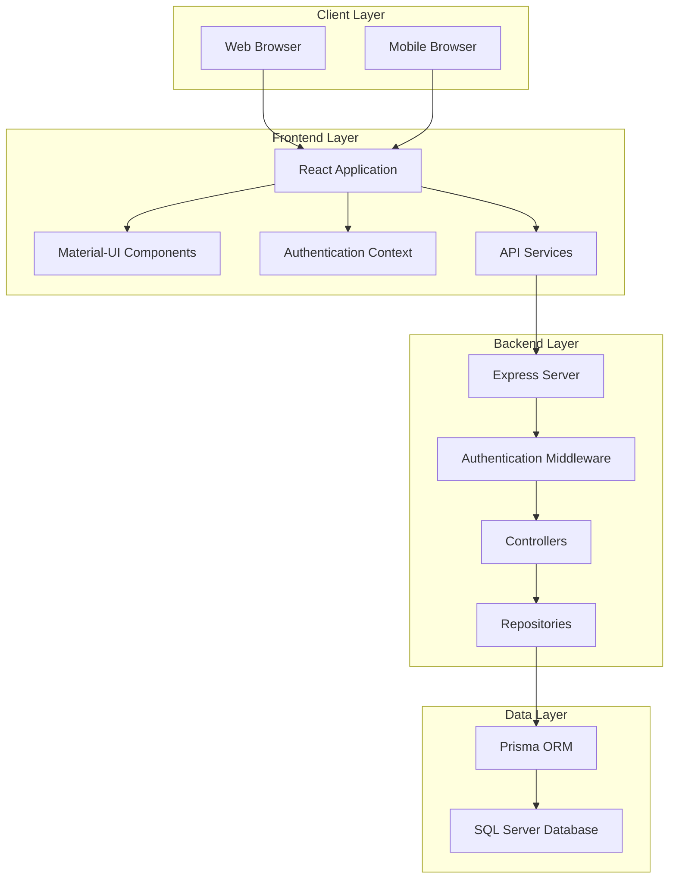

# CHƯƠNG II: CƠ SỞ LÝ THUYẾT VÀ KHẢO SÁT THỰC TẾ

## 2.1 Cơ sở lý thuyết

### 2.1.1 Công nghệ sử dụng

#### 2.1.1.1 Frontend - ReactJS với TypeScript

**ReactJS** là một thư viện JavaScript mã nguồn mở được phát triển bởi Facebook, chuyên dụng để xây dựng giao diện người dùng (UI) cho các ứng dụng web và mobile.

**Ưu điểm của ReactJS:**
- **Component-based Architecture**: Cho phép tái sử dụng code hiệu quả
- **Virtual DOM**: Tối ưu hóa hiệu suất render
- **Ecosystem phong phú**: Nhiều thư viện hỗ trợ như Material-UI, React Router
- **Community lớn**: Dễ dàng tìm kiếm tài liệu và giải pháp

**TypeScript** được tích hợp để:
- Kiểm tra kiểu dữ liệu tại thời điểm compile
- Tăng tính bảo mật và ổn định của code
- Hỗ trợ IntelliSense tốt hơn trong quá trình phát triển

**Material-UI (MUI)** được sử dụng để:
- Tạo giao diện đẹp, nhất quán theo Material Design
- Tiết kiệm thời gian phát triển với các component có sẵn
- Đảm bảo responsive design cho nhiều thiết bị

#### 2.1.1.2 Backend - NodeJS với Express và TypeScript

**NodeJS** là môi trường runtime JavaScript phía server, cho phép chạy JavaScript ngoài trình duyệt.

**Ưu điểm của NodeJS:**
- **Non-blocking I/O**: Xử lý đồng thời nhiều request hiệu quả
- **NPM Ecosystem**: Hàng triệu package có sẵn
- **Cùng ngôn ngữ**: JavaScript/TypeScript cho cả frontend và backend
- **Hiệu suất cao**: Đặc biệt tốt cho ứng dụng real-time

**Express Framework** được chọn vì:
- Lightweight và linh hoạt
- Middleware system mạnh mẽ
- RESTful API development dễ dàng
- Cộng đồng phát triển lớn

#### 2.1.1.3 Hệ quản trị cơ sở dữ liệu - SQL Server với Prisma ORM

**SQL Server** được lựa chọn vì:
- **Độ tin cậy cao**: Phù hợp với dữ liệu y tế quan trọng
- **Bảo mật mạnh**: Hỗ trợ encryption, authentication nâng cao
- **Scalability**: Có thể mở rộng theo nhu cầu bệnh viện
- **Integration**: Tích hợp tốt với hệ thống Windows của bệnh viện

**Prisma ORM** được sử dụng để:
- **Type-safe**: Đảm bảo kiểu dữ liệu chính xác
- **Auto-generated Client**: Tự động tạo client từ schema
- **Migration Management**: Quản lý phiên bản database hiệu quả
- **Query Optimization**: Tối ưu hóa truy vấn tự động

#### 2.1.1.4 Công nghệ bổ trợ

**JWT (JSON Web Token)** cho authentication:
- Stateless authentication
- Bảo mật thông tin người dùng
- Dễ dàng scale horizontal

**bcryptjs** cho mã hóa mật khẩu:
- Hash password an toàn
- Salt rounds có thể điều chỉnh
- Chống rainbow table attacks

### 2.1.2 Kiến trúc hệ thống

#### 2.1.2.1 Monorepo Architecture

Hệ thống được tổ chức theo mô hình **Monorepo**, bao gồm:

```
med-booking/
├── frontend/          # React Application
│   ├── src/
│   │   ├── components/    # UI Components
│   │   ├── services/      # API Services
│   │   ├── contexts/      # React Contexts
│   │   └── types/         # TypeScript Types
│   └── public/
├── backend/           # Node.js API Server
│   ├── src/
│   │   ├── controllers/   # Business Logic
│   │   ├── repositories/  # Data Access Layer
│   │   ├── middleware/    # Authentication, Validation
│   │   ├── routes/        # API Routes
│   │   └── types/         # TypeScript Types
│   └── prisma/           # Database Schema & Migrations
└── README.md
```

**Ưu điểm của Monorepo:**
- **Code sharing**: Chia sẻ types, utilities giữa frontend và backend
- **Atomic commits**: Thay đổi đồng bộ trên cả hai phần
- **Simplified dependency management**: Quản lý dependencies tập trung
- **Consistent tooling**: Cùng một bộ công cụ cho toàn dự án

#### 2.1.2.2 Sơ đồ kiến trúc hệ thống



#### 2.1.2.3 Kiến trúc 3-Layer

**Presentation Layer (Frontend):**
- React Components cho giao diện người dùng
- State management với React Context
- Client-side routing với React Router

**Business Logic Layer (Backend Controllers):**
- Xử lý logic nghiệp vụ
- Validation dữ liệu đầu vào
- Authorization và authentication

**Data Access Layer (Repositories):**
- Trừu tượng hóa truy cập database
- Tối ưu hóa queries
- Quản lý transactions

## 2.2 Khảo sát thực tế tại Bệnh viện

### 2.2.1 Mô tả quy trình nghiệp vụ hiện tại

#### 2.2.1.1 Quy trình đặt lịch khám truyền thống

**Bước 1: Bệnh nhân đến bệnh viện**
- Bệnh nhân phải đến trực tiếp bệnh viện
- Xếp hàng tại quầy tiếp nhận
- Thời gian chờ đợi: 30-60 phút trong giờ cao điểm

**Bước 2: Đăng ký thông tin**
- Nhân viên tiếp nhận ghi thông tin thủ công
- Kiểm tra giấy tờ tùy thân
- Tạo hồ sơ bệnh án giấy

**Bước 3: Chọn bác sĩ và khung giờ**
- Nhân viên tra cứu lịch bác sĩ từ sổ sách
- Thông báo khung giờ trống
- Bệnh nhân chọn thời gian phù hợp

**Bước 4: Xác nhận và thanh toán**
- Ghi thông tin vào sổ đăng ký
- Thu phí khám (nếu có)
- Cấp phiếu khám bệnh

**Bước 5: Chờ khám**
- Bệnh nhân chờ trong khu vực chờ
- Gọi tên theo thứ tự đăng ký
- Không có thông báo trước về thời gian chờ

#### 2.2.1.2 Các vấn đề của quy trình hiện tại

**Vấn đề về thời gian:**
- Bệnh nhân mất nhiều thời gian di chuyển đến bệnh viện
- Thời gian chờ đợi không được thông báo trước
- Xếp hàng dài trong giờ cao điểm (8-10h sáng, 14-16h chiều)

**Vấn đề về quản lý:**
- Khó kiểm soát số lượng bệnh nhân đăng ký
- Dễ xảy ra nhầm lẫn trong sổ sách thủ công
- Không có backup dữ liệu khi sổ sách bị mất

**Vấn đề về trải nghiệm:**
- Bệnh nhân không biết trước lịch trống của bác sĩ
- Không thể hủy hoặc thay đổi lịch hẹn dễ dàng
- Thiếu thông tin về bác sĩ (chuyên môn, kinh nghiệm)

### 2.2.2 Phân tích và xác định yêu cầu hệ thống

#### 2.2.2.1 Yêu cầu của người dùng/bệnh nhân

**Yêu cầu chức năng:**

*Đăng ký và quản lý tài khoản:*
- Đăng ký tài khoản với thông tin cá nhân (họ tên, số điện thoại, email, địa chỉ)
- Đăng nhập/đăng xuất an toàn
- Cập nhật thông tin cá nhân
- Quản lý thông tin liên hệ khẩn cấp

*Đặt lịch khám bệnh:*
- Xem danh sách bác sĩ theo chuyên khoa
- Xem thông tin chi tiết bác sĩ (chuyên môn, kinh nghiệm, học vấn)
- Xem lịch trống của bác sĩ theo ngày
- Chọn khung giờ phù hợp (slot 30 phút)
- Nhập triệu chứng và ghi chú
- Xác nhận đặt lịch

*Quản lý lịch hẹn:*
- Xem danh sách lịch hẹn (đã đặt, đã xác nhận, đã hoàn thành, đã hủy)
- Xem chi tiết từng lịch hẹn
- Hủy lịch hẹn (chỉ khi còn ở trạng thái "Chờ xác nhận")
- Thay đổi thời gian (trong trường hợp đặc biệt)

*Xem lịch sử khám bệnh:*
- Xem danh sách các lần khám đã hoàn thành
- Xem kết quả khám, chẩn đoán
- Xem đơn thuốc được kê
- Tải xuống kết quả khám (PDF)

*Nhận thông báo:*
- Thông báo xác nhận lịch hẹn
- Nhắc nhở trước giờ khám (1 ngày, 2 giờ)
- Thông báo thay đổi lịch từ phía bệnh viện
- Thông báo kết quả khám

**Yêu cầu phi chức năng:**

*Hiệu suất:*
- Thời gian tải trang < 3 giây
- Hỗ trợ đồng thời 100+ người dùng
- Uptime > 99.5%

*Bảo mật:*
- Mã hóa thông tin cá nhân
- Xác thực 2 lớp cho tài khoản quan trọng
- Tuân thủ quy định bảo vệ dữ liệu y tế

*Khả năng sử dụng:*
- Giao diện thân thiện, dễ sử dụng
- Hỗ trợ responsive trên mobile
- Hỗ trợ người dùng cao tuổi

#### 2.2.2.2 Yêu cầu của nhân viên y tế/bác sĩ

**Yêu cầu chức năng:**

*Quản lý lịch làm việc:*
- Thiết lập lịch làm việc hàng tuần
- Đặt thời gian nghỉ, ngày lễ
- Xem tổng quan lịch theo ngày/tuần/tháng
- Điều chỉnh thời gian slot khám (15, 30, 45 phút)

*Quản lý lịch hẹn:*
- Xem danh sách lịch hẹn theo ngày
- Xem thông tin chi tiết bệnh nhân
- Xác nhận hoặc từ chối lịch hẹn
- Ghi chú lý do từ chối (nếu có)
- Thay đổi thời gian khám (khi cần thiết)

*Quản lý hồ sơ bệnh nhân:*
- Xem lịch sử khám của bệnh nhân
- Ghi chẩn đoán và kết quả khám
- Kê đơn thuốc điện tử
- Yêu cầu xét nghiệm bổ sung
- Hẹn tái khám

*Báo cáo và thống kê:*
- Thống kê số lượng bệnh nhân khám theo ngày/tuần/tháng
- Báo cáo doanh thu (nếu có phí khám)
- Phân tích xu hướng bệnh lý
- Đánh giá hiệu quả công việc

**Yêu cầu phi chức năng:**

*Hiệu suất:*
- Truy cập nhanh vào hồ sơ bệnh nhân
- Đồng bộ dữ liệu real-time
- Backup tự động mỗi ngày

*Bảo mật:*
- Phân quyền truy cập theo vai trò
- Log mọi thao tác với hồ sơ bệnh nhân
- Mã hóa dữ liệu nhạy cảm

#### 2.2.2.3 Yêu cầu của quản trị viên

**Yêu cầu chức năng:**

*Quản lý người dùng:*
- Tạo, sửa, xóa tài khoản người dùng
- Phân quyền theo vai trò (Admin, Doctor, Patient)
- Khóa/mở khóa tài khoản
- Đặt lại mật khẩu
- Xem lịch sử hoạt động của người dùng

*Quản lý bác sĩ:*
- Thêm thông tin bác sĩ mới
- Cập nhật thông tin chuyên môn, học vấn
- Phân bổ bác sĩ vào các khoa
- Thiết lập mức phí khám
- Quản lý trạng thái hoạt động

*Quản lý phòng khám:*
- Tạo và quản lý danh sách phòng khám
- Phân bổ phòng cho từng bác sĩ
- Quản lý trang thiết bị phòng khám
- Lên lịch bảo trì, vệ sinh

*Quản lý khoa/chuyên môn:*
- Tạo và quản lý danh sách khoa
- Phân loại chuyên môn
- Thiết lập trưởng khoa
- Quản lý ngân sách khoa

*Báo cáo và thống kê tổng thể:*
- Dashboard tổng quan hoạt động bệnh viện
- Thống kê số lượng bệnh nhân theo khoa
- Báo cáo hiệu suất làm việc của bác sĩ
- Phân tích xu hướng sử dụng dịch vụ
- Báo cáo tài chính (doanh thu, chi phí)

*Quản lý hệ thống:*
- Cấu hình thông số hệ thống
- Quản lý backup và restore
- Giám sát hiệu suất hệ thống
- Quản lý log và audit trail
- Cập nhật và bảo trì hệ thống

**Yêu cầu phi chức năng:**

*Bảo mật cao:*
- Xác thực đa lớp cho admin
- Mã hóa toàn bộ dữ liệu nhạy cảm
- Audit log chi tiết mọi thao tác
- Tuân thủ các tiêu chuẩn bảo mật y tế

*Hiệu suất và độ tin cậy:*
- Hệ thống hoạt động 24/7
- Backup tự động và disaster recovery
- Monitoring và alerting
- Scalability để mở rộng trong tương lai

*Khả năng tích hợp:*
- API để tích hợp với hệ thống HIS hiện có
- Import/export dữ liệu từ các hệ thống cũ
- Tích hợp với hệ thống thanh toán
- Kết nối với các thiết bị y tế (trong tương lai)

### 2.2.3 Ma trận truy xuất yêu cầu

| Vai trò | Đăng ký/Đăng nhập | Đặt lịch | Quản lý lịch | Xem hồ sơ | Báo cáo | Quản trị |
|---------|-------------------|----------|--------------|-----------|---------|----------|
| Bệnh nhân | ✓ | ✓ | ✓ (cá nhân) | ✓ (cá nhân) | - | - |
| Bác sĩ | ✓ | - | ✓ (xác nhận) | ✓ (bệnh nhân) | ✓ (cá nhân) | - |
| Admin | ✓ | - | ✓ (toàn bộ) | ✓ (toàn bộ) | ✓ (toàn bộ) | ✓ |

### 2.2.4 Kết luận khảo sát

Qua quá trình khảo sát thực tế tại Bệnh viện Phục hồi chức năng Hà Nội, nhóm đã xác định được những vấn đề cốt lõi của quy trình đặt lịch khám truyền thống và đưa ra giải pháp số hóa toàn diện. Hệ thống đặt lịch khám bệnh online không chỉ giải quyết các vấn đề hiện tại mà còn tạo nền tảng cho việc phát triển các tính năng nâng cao trong tương lai như telemedicine, AI hỗ trợ chẩn đoán, và tích hợp IoT thiết bị y tế.

Việc lựa chọn công nghệ hiện đại (React, Node.js, SQL Server, Prisma) đảm bảo hệ thống có thể mở rộng, bảo trì dễ dàng và tích hợp với các hệ thống khác của bệnh viện trong tương lai.

